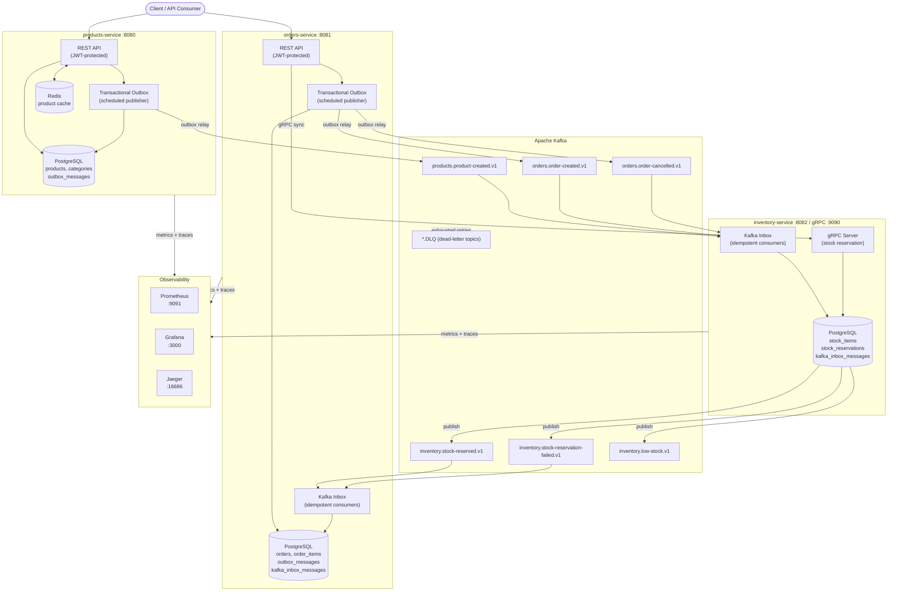
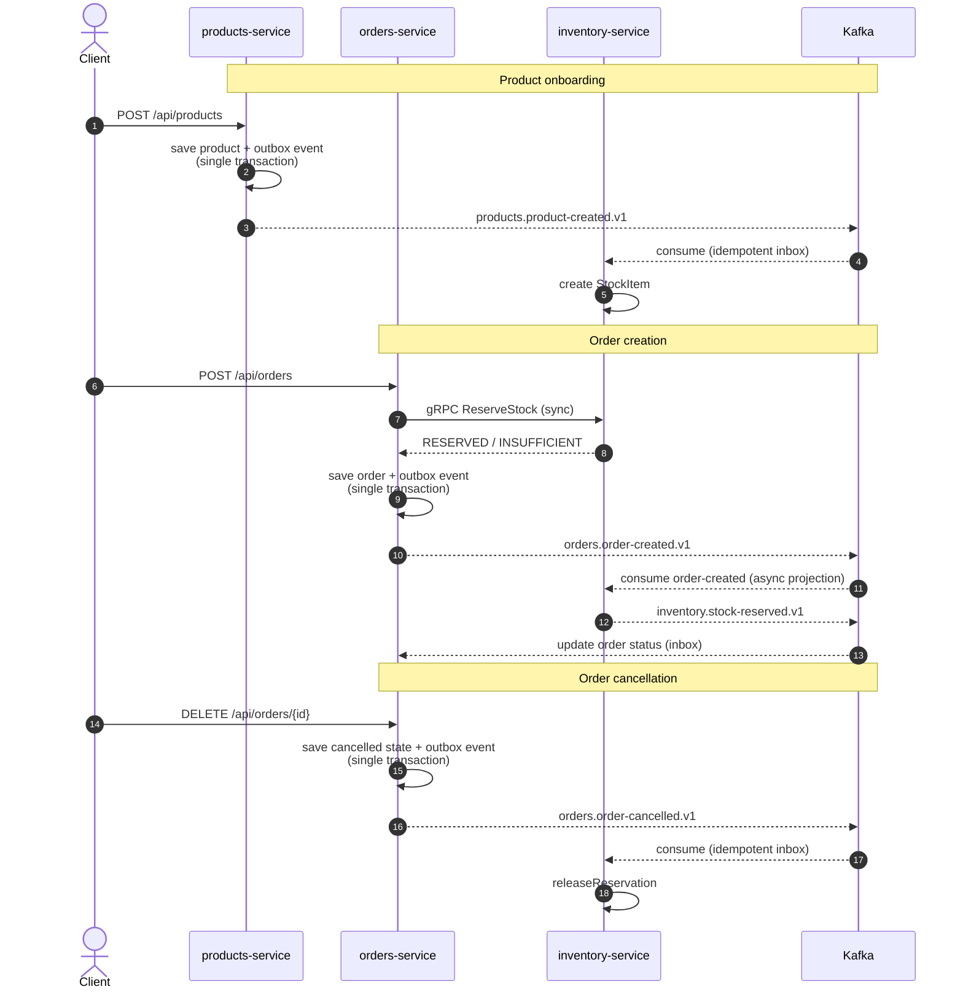
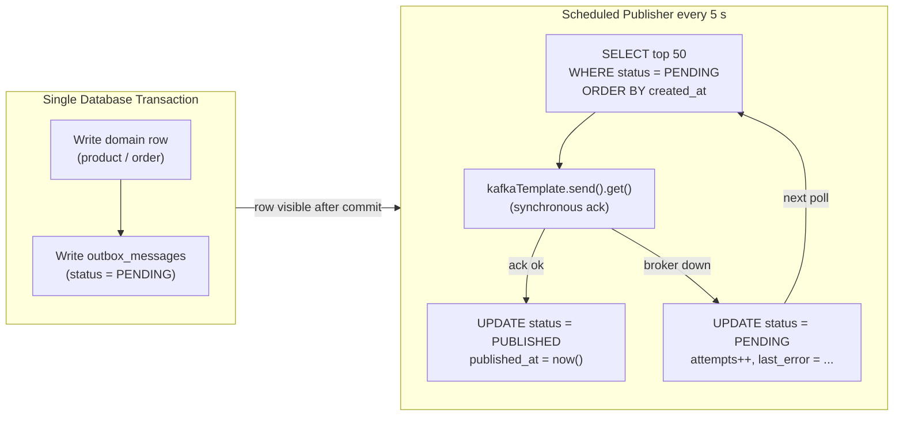
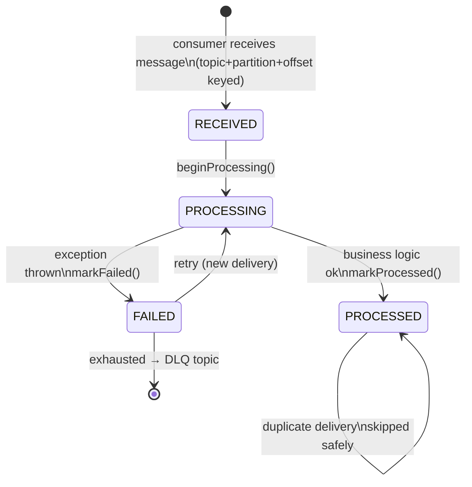

# Enterprise Microservices Platform

Production-oriented Java/Spring Boot 4 microservices reference implementation. Demonstrates distributed transactions, event-driven consistency, transactional outbox, Kafka retry/DLQ, concurrency-safe inventory, and reproducible integration tests — patterns that matter in real production systems.

---

## Architecture



---

## Event Flow — Order Lifecycle



---

## Transactional Outbox Pattern



---

## Kafka Inbox — Idempotency State Machine



---

## Bounded Contexts

| Service | Owns | Exposes |
|---|---|---|
| **products-service** | products, categories, stock-status projection | REST + Kafka producer |
| **orders-service** | orders, order items, order state | REST + Kafka producer/consumer |
| **inventory-service** | stock items, reservations, inbox | gRPC + REST + Kafka producer/consumer |
| **contracts** | gRPC `.proto` definitions | shared compile artifact |

Services do not share database tables. Cross-service reads use published events or synchronous gRPC.

---

## Patterns Implemented

### Transactional Outbox
Both `products-service` and `orders-service` write domain rows and outbox events in a single transaction. A scheduled publisher polls `PENDING` rows and sends to Kafka, marking `PUBLISHED` only on confirmed broker acknowledgement. Retries survive Kafka downtime with persisted `attempts` and `lastError`.

### Kafka Inbox Idempotency
`inventory-service` and `orders-service` consumers key inbox records on `(topic, partition, offset)`. State transitions: `RECEIVED → PROCESSING → PROCESSED | FAILED`. Duplicate broker deliveries are detected and skipped before business logic executes.

### Kafka Retry and Dead-Letter Queue
`DefaultErrorHandler` with exponential backoff routes exhausted retries to `<topic>.DLQ` via `DeadLetterPublishingRecoverer`. Failure metadata is persisted for operational visibility.

### Concurrency-Safe Inventory
Reservation uses an atomic SQL update (`available >= requested`) inside an optimistic-locking transaction. One reservation per order (`UNIQUE(order_id)`). Partial multi-line failures roll back atomically. Concurrency tests verify no-oversell under simultaneous requests — validated against both H2 and real PostgreSQL via Testcontainers.

---

## Security

- No hardcoded production secrets: JWT secret and all datasource credentials are sourced from environment variables.
- JWT validated at startup: Base64 + minimum key-length enforced.
- Write endpoints are protected; consistent API error envelopes on all failure paths.

---

## Testing Strategy

| Layer | What | Tool |
|---|---|---|
| Unit | Service logic, inbox/outbox state | JUnit 5 + Mockito |
| Slice | REST controllers | `@WebMvcTest` + MockMvc |
| Integration | Outbox atomicity, concurrency control | `@SpringBootTest` + H2 |
| Container | Full-stack: Postgres + Kafka + Redis | Testcontainers (`disabledWithoutDocker`) |
| PostgreSQL | Concurrency under real MVCC | Testcontainers PostgreSQL |

```bash
./mvnw -B clean verify
```

Container tests require Docker; they skip gracefully in environments without it.

---

## Local Run

1. Copy `.env.example` to `.env` and adjust values.
2. Start infrastructure:

```bash
docker compose up -d postgres kafka redis prometheus grafana jaeger
```

3. Run services (each in a separate terminal):

```bash
cd products-service  && ../mvnw spring-boot:run
cd orders-service    && ../mvnw spring-boot:run
cd inventory-service && ../mvnw spring-boot:run
```

---

## Observability

- **Metrics**: `/actuator/prometheus` on each service — scraped by Prometheus.
- **Health/Readiness**: `/actuator/health` and `/actuator/health/readiness`.
- **Tracing**: Micrometer + OpenTelemetry OTLP export to Jaeger.
- **Correlation ID**: `X-Correlation-Id` propagated through HTTP headers and logged with trace/span IDs.

| Dashboard | URL |
|---|---|
| Prometheus | `http://localhost:9091` |
| Grafana | `http://localhost:3000` |
| Jaeger | `http://localhost:16686` |

---

## Failure Scenarios Handled

| Scenario | Defense |
|---|---|
| Kafka unavailable during write | Outbox stays PENDING; retried on next poll cycle |
| Duplicate Kafka delivery | Inbox dedupe on `(topic, partition, offset)` |
| Concurrent stock requests | Atomic SQL update prevents oversell |
| Insufficient multi-line stock | Transaction rollback on any line failure |
| Duplicate reservation release | Idempotent release; double stock increment blocked |
| Exhausted retries | Routed to `.DLQ` topic for manual inspection |

---

## Why Outbox + Inbox

Publishing directly from a service call (e.g. `KafkaTemplate.send()` in an HTTP request handler) is at-most-once: a crash between the DB commit and the send loses the event permanently. The outbox pattern provides at-least-once delivery by making the event a durable DB row first. The inbox provides idempotent processing so that at-least-once delivery does not cause duplicate side effects.

---

## Trade-offs and Deliberate Omissions

- Focused on consistency patterns over breadth of business features.
- Single-repo topology for portfolio readability, not multi-team governance.
- gRPC sync + Kafka async for reservation is dual-path; the sync path gives immediate feedback, the async path ensures eventual consistency.
- Local defaults (`application-local.yml`) keep onboarding friction low without exposing production values.

---

## ADR Index

- [001 Communication Patterns](docs/adr/001-communication-patterns.md)
- [002 Transactional Outbox](docs/adr/002-transactional-outbox.md)
- [003 Inbox Idempotency and DLQ](docs/adr/003-inbox-idempotency-and-dlq.md)
- [004 Inventory Concurrency Control](docs/adr/004-inventory-concurrency-control.md)
- [005 Testcontainers for Reproducible Tests](docs/adr/005-testcontainers-for-reproducible-tests.md)
- [006 Observability Strategy](docs/adr/006-observability-strategy.md)
